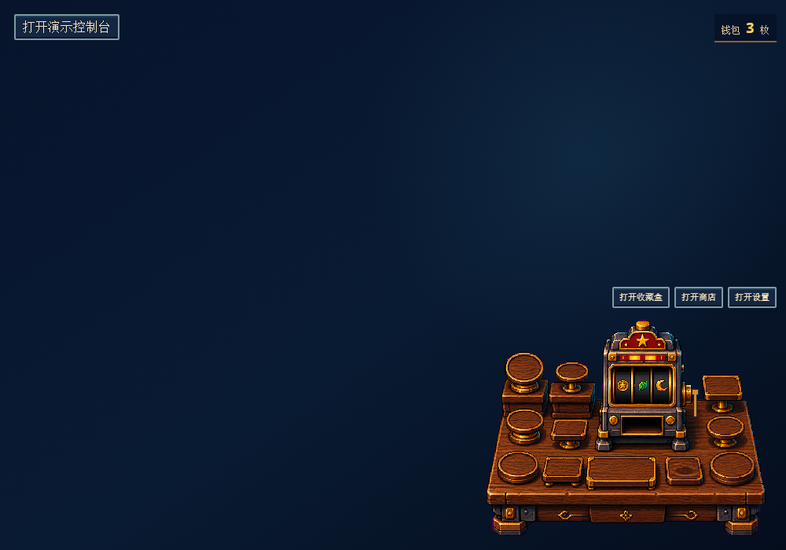

# DSH Desktop Slot Widget

[](https://github.com/YuiKiZJ2026/dsh-desktop-slot-widget/actions/workflows/ci.yml)



一个面向社区版 DSH Desktop 2.x 的像素老虎机 companion 插件。DSH 启动后，Host 会创建
一个可在整个 Windows 桌面拖动的透明像素小窗；拖到屏幕边缘会自动收起，重新点击露出的
边缘标签即可展开。小窗与 DSH 属于同一进程生命周期，彻底退出 DSH 后会一并关闭。Host
负责保存钱包、收藏、Token 能量和待结算 spin。它不是 DeepSeek 官方产品，也不代表
DeepSeek 或 DSH Desktop 的背书。

游戏硬币和收藏品只用于插件内的装饰与进度，没有现金价值，不能交易、提现，也不会提升
模型、Token、工具或审批权限。

项目维护说明见 [贡献指南](CONTRIBUTING.md)、[安全政策](SECURITY.md) 和
[版本记录](CHANGELOG.md)。

## 兼容与前置条件

- Node.js `^22.22.2 || >=24.15.0`。
- DSH Desktop 2.x；兼容基线为 DeepSeek Harness `0.1.1-rc.2` package set。
- Host profile 必须为 `storageDomain` 配置可用的持久化 backend route。插件无法打开存储
  domain 时会中止启动并给出诊断，不会回退到浏览器 `localStorage` 或静默清空存档。
- 桌面伴生窗使用 DSH Desktop 自带的 Electron `BrowserWindow`，不会启动额外常驻进程；
  `contextIsolation`、renderer sandbox 和 `webSecurity` 保持开启，且不向页面暴露 Node 或
  Electron IPC。非 Electron Host 会回退到公开的 `shell.overlay` slot。

## 安装、检查与卸载

在包含预构建包的目录运行：

```bash
dsh plugin --profile desktop add ./dsh-desktop-slot-widget-0.6.0.tgz
dsh --profile desktop --dump-config
# restart DSH Desktop
dsh plugin --profile desktop remove dsh-desktop-slot-widget
```

安装后必须重启 DSH Desktop，让插件进入新的 Cordis generation。启动完成后，老虎机会
以桌面伴生小窗显示，不需要创建或打开会话。直接拖动老虎机机身即可移动整个小窗；桌面
圆台仍保留收藏品拖放命中区。靠近屏幕任一边缘后，窗口会缩成独立的 28×48 像素标签，
不会露出钱包或 Token 文字。拖动小窗的任一角可以在 0.75–1.60 倍之间缩放；桌面、老虎机、
按钮、文字和收藏品会保持同一比例，窗口不会出现系统滚动条，缩放值会写入 Host 存档并在
重启后恢复。插件按 profile 安装；切换 profile 不会复制插件。

发布包只插入以下 Cordis row，不修改安全、审批、sandbox 或 credential 配置：

```yaml
- insert:
    - id: dsh-desktop-slot-widget
      name: dsh-desktop-slot-widget
```

## 玩法与收藏盒

- 右侧实体摇杆是唯一的开局入口。钱包有硬币时拉一次即可自动投入 1 枚并开始转动，左侧不再有透明投币热点。
- 抽中的收藏品会以放大的 64 像素奖励动画进入收藏盒，不会自动落到桌面，也不会提前占用展示位。
- 收藏盒是 12 格仓库，每格只放一个收藏品。把已拥有的格子直接拖向桌面；靠近 12 个圆台或
  小台时会出现发光吸附圈，松手后精确落位。
- 桌面上的收藏品也能再次拖动换位；拖到已占用位置时，新物品替换旧物品，旧物品回仓库。
  把物品拖回仓库区域或点击格子上的“收回”可取消展示。
- 渲染按每件素材的可见像素边界做中心线和底边校正，并统一可见高度；透明留白不同的水晶、
  徽章等不会再看起来歪斜或比例失真。
- 旧版已经展示的收藏品会在首次读取时按原顺序迁移到可用桌位，不会丢失所有权。

## 硬币与实际 Token

- 每个本地自然日首次打开可领取 3 枚每日硬币，重复命令不会重复发放。
- 只有由顶层用户消息触发、成功完成且提供权威 usage 的 turn 才累计实际 Token；usage
  缺失、失败或中断、子代理、后台或 synthetic turn 均不发币。
- 实际用量为 provider 权威上报的 `input + output + cacheWrite + cacheRead`；
  `reasoningTokens` 已包含在 output 中，不再重复相加。
- 每满 10,000 个实际 Token 发 1 枚，不再截断单次 turn，因此一个大 turn 可以产生多枚。
  不足 10,000 的余量跨 turn 和日期保留；Token 奖励每日最多 8 枚，并受每日 25 枚工作
  奖励总上限约束。达到当日上限后仍记录防重水位，但不累积超限用量。
- 从 0.5.8 或更早版本升级时，Host 会用会话历史重建实际 Token 余量，同时保留旧钱包，
  不会把历史上已经结算过的加权进度再次发成硬币。
- 当前没有权威 provider 时，插件不会从助手文本、shell 退出码、工具次数或程序运行时间
  猜测“任务完成”“测试通过”或“有效专注”奖励。

## 存储、隐私与恢复

权威状态保存在 DSH Host storage domain 中，可跨 Desktop 的随机 loopback 端口和 Host
重启保留。正式插件不会读取或迁移旧浏览器原型的 `localStorage` 存档，也不会保存提示词、
助手回复、工具参数或工具输出。Client 断线时保持只读；恢复连接后重新读取 Host 投影。

## 从源码验证

DSH peer 由宿主提供；本仓库的 ambient contract 只用于离线类型检查。常用命令：

```bash
npm ci --legacy-peer-deps
npm run typecheck
npm run test:unit
npm run test:coverage
npm run build
npm run test:package
npm run test:e2e
```

`npm run build` 生成 `lib/index.js`、lazy-CJS `lib/client.js`、独立的
`lib/companion.js`、声明与 source map、伴生页、审计用 `assets/`，以及
`dsh-desktop-slot-widget-0.6.0.tgz`。

发布源码归档是显式、release-only 步骤，不属于普通 `npm run build`：

```bash
npm run build:source
```

该命令只需要 Git 与 Node.js，只从已提交的 `HEAD` 读取严格 allowlist 内的源码、测试、配置和
文档，并生成 `../dsh-desktop-slot-widget-0.6.0-source.zip`，归档前缀为
`dsh-desktop-slot-widget-0.6.0/`。工作树改动不会混入归档；根 `.superpowers/`、
`.research/`、`node_modules/`、生成的根 `lib/`、`assets/`、tgz、`test-results/`、`tmp/`
和 `dist/` 均排除。`public/assets/` 与 `src/plugin/client/assets/` 是受审源码资源，会保留。

CI 另有固定 `ubuntu-24.04`、`pnpm@11.7.0` 和官方
`@deepseek-ai/dsh@0.1.1-rc.2` 的真实 Web profile 生命周期 gate；它安装本地 tgz、验证
boot manifest/Client/真实路由、优雅重启与持久化后再卸载插件。Windows gate 也会执行
typecheck、完整 unit/build/package 流程和零像素容差视觉基线。覆盖率门禁要求 statements、
branches、functions、lines 均不低于 80%。真实 DSH smoke 同时支持 Linux 的 `dsh` 命令和
Windows 下通过 `--dsh-entry <lib/bin.js>` 直接调用固定 DSH 入口。

## 已知限制

DeepSeek Harness 仍处于 developer preview，公开事件、Client loader、Electron 宿主和持久化
格式可能发生破坏性变化。本版固定面向上述 DSH Desktop 2.x / Electron 43 兼容基线，不声称
兼容未知的未来 DSH/Desktop 版本。只应安装你信任的第三方 Host 插件。
